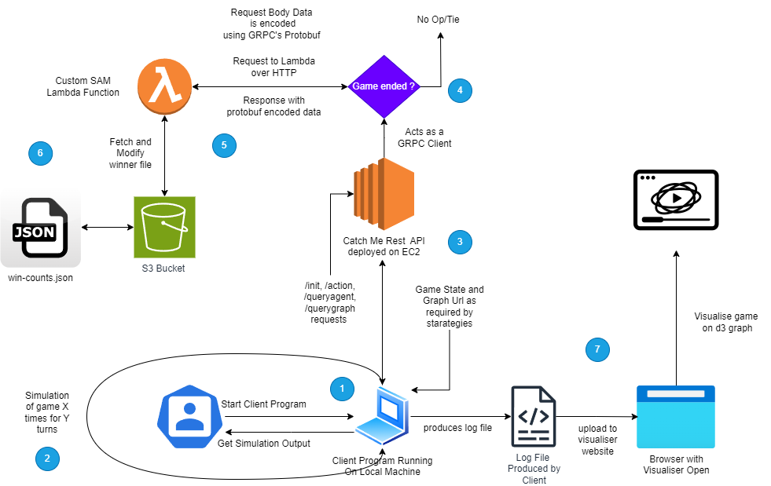
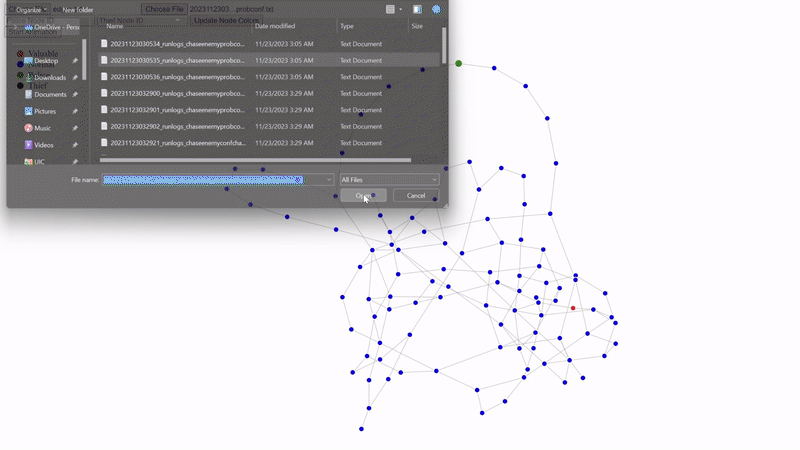

# CS 441 Catch Me Game ReadMe

Welcome to the Catch Me Game project, a comprehensive cloud-based application designed to offer an interactive, distributed gaming experience. 
This project is a part of an advanced assignment focusing on cloud computing, distributed systems, and Scala programming. 
It is built to provide a unique take on the classic chase game, leveraging modern technologies and programming paradigms.

In this game, players engage in a strategic graph-based environment as either a Policeman or a Thief, navigating through a dynamically generated network of nodes. 
The game is deployed on the cloud as a microservice, allowing players to interact with the game server using HTTP requests.

We have deployed the game rest api on AWS EC2 instance and the lambda function that uses grpc's protobuf on AWS Lambda.

This project is a part of an assignment in the CS441 Distributed Objects for Cloud Computing course at University of Illinois at Chicago as taught by [Dr Mark Grechanik](https://www.cs.uic.edu/~drmark/).
The Homework Description can be found [here](https://github.com/0x1DOCD00D/CS441_Fall2023/blob/main/Homework3.md).

> Note: Due to time constraints on the submission deadline (and poor time management on my part), 
GPT4 has been used heavily in the creation of this readme and sometimes may sound like a robot wrote it. 
The accuracy of the content however has been verfied by me during the multiple passes I made through the readme.


## Requirements fulfilled with features as part of the homework 3

- [x] **RESTful API**: The game is deployed as a RESTful API service, allowing players to interact with the game server using HTTP requests.
- [x] **AWS Lambda**: [Bonus GRPC Part] The game server utilizes AWS Lambda for processing game winners using gRPC's protobuf format and storing results in an Amazon S3 bucket.
- [x] **AWS EC2**: The game server is deployed on an Amazon EC2 instance.
- [x] **Client with Multiple Strategies**: The game client is designed to play the game using various strategies, including probabilistic and confidence-based approaches.
- [x] **Usage of Regional and Query Graph**: The game client uses the regional and query graph to make decisions.
- [x] ** confidence scores and valudable data distance in api**: The rest api returns the confidence scores and the distance of the valuable data from the agent.
- [x] ** confidence scores and valudable data distance in client**: The client uses the confidence scores and the distance of the valuable data from the agent to make decisions.
- [x] ** dicussion of the strategies**: The strategies are discussed in the results section of this readme
- [x] **Visualization Tool**: The game client generates log files that can be visualized using a web-based tool, providing an interactive playback of game sessions. The tool is deployed on Vercel.
- [x] **Docker and Docker Compose**: The game server is deployed using Docker and Docker Compose, allowing for easy deployment and testing.
- [x] **Unit Tests**: The game server and client are tested using unit tests.
- [x] **logging and config files**: The game server and client use logging and config files.
- [x] **AWS S3**: The game server uses Amazon S3 to store game winners and retrieve graph data.

## Clone Instructions

Use the below command to clone the repository and its submodules:

```bash 
git submodule init
git submodule update
```


## Workflow

The workflow of this project can be explained by the following diagram:



Explanation:

1. The Rest API is deployed on AWS EC2 instance and has the endpoints for the game.
2. The client is run locally but can be deployed on any machine. It has the strategies for the game.
3. The client is started with the urls for the graph files and the strategies for each agent, the maximum number of moves and the number of games to be played.
4. The client program starts the simulation, it initializes the game and starts the game.
5. The client program makes the requests to the rest api and gets the response. 
6. The response is parsed and the next move is decided based on the strategy.
7. The client program makes the next move and the process is repeated until the game ends.
8. The client program logs the game data in the log file.
9. The REST API server once it decides the winner, it sends the winner data to the lambda function. This is done using gRPC's protobuf.
10. The lambda function stores the winner data in the S3 bucket.
11. The Visualization tool at this [website](https://chorpoliceviz.vercel.app/) can be used to visualise the log files generated using the game play by the client.
12. The client program prints the winner data and average number of moves for both the agents on the console.

## Components of the Project

This repository consists of several interrelated components, each serving a specific purpose in the ecosystem of the game:

1. **[CS441GraphCatchMeRest](./CS441GraphCatchMeRest)**:
   - A RESTful API service that acts as the primary interface for the game.
   - Provides endpoints such as `/action`, `/init`, `/reset`, `/querygraph`, and `/queryagent` for game interactions.

2. **[CS441GraphCatchMeClient](./CS441CatchMeClient)**:
   - An automated client application that plays the game using various strategies.
   - Implements strategies like `random`, `chaseenemy`, `chasevaluable`, and several probabilistic and confidence-based approaches to simulate different playing styles.

3. **[CS441LambdaStoreS3](./CS441LambdaStoreS3)**:
   - A serverless component utilizing AWS Lambda and S3.
   - Processes game winners using gRPC's protobuf format, handling HTTP requests to store winner data in S3, and responds to the REST API server.

4. **[CS441ThiefPoliceViz](./chorpoliceviz)**:
   - A visualization tool built with HTML, CSS, and JavaScript.
   - Visualizes the state of the Policeman and Thief in the game, utilizing client logs for an interactive playback of game sessions.

## Game Mechanics

- **Gameplay**: Players can pick police and thief agents and one initiated the game places agents on nodes within a graph. The objective for the Thief is to reach a node with valuable data without being caught, while the Policeman aims to capture the Thief.
- **Graph Dynamics**: The game operates on two graph representations - the original graph (OG) and its perturbed version (PG). Players make moves based on limited information from PG, with a confidence scoring system.
- **Winning Conditions**: The game ends when the Thief acquires the valuable data, the Policeman captures the Thief, or a player becomes stuck with no available moves.


##  [CS 441 Catch Me Game (Rest API )](./docs/CatchMeRestAPI.md)

Click the above hyperlink for detailed documentation of the rest api.

### Introduction

"Catch Me Game" is an interactive game implemented in Scala, utilizing Akka HTTP for API services. It simulates a chase scenario where players take on the roles of police and thief, navigating through a graph-based environment. The game leverages advanced Scala features and demonstrates integration with external services like AWS Lambda.

### Features

- Graph-based game environment.
- RESTful API for game interaction.
- Asynchronous and concurrent processing with Akka actors.
- Docker and Docker Compose support for easy deployment.

### API Routes

The game exposes several endpoints:

Postman Collection Documentation: [https://documenter.getpostman.com/view/30303534/2s9YeD8YTz](https://documenter.getpostman.com/view/30303534/2s9YeD8YTz)

1. **Action (`/action`)**: POST request to perform an action (move police or thief).
2. **Initialize Game (`/init`)**: POST request to initialize the game environment. Requires Auth.
3. **Reset Game (`/reset`)**: POST request to reset the game environment. Requires Auth.
4. **Query Graph (`/querygraph`)**: GET request to retrieve the current state of the game graph.
5. **Query Agent (`/queryagent`)**: POST request to get data about a specific agent (police or thief).

### Getting Started

#### Prerequisites

- Scala
- SBT (Scala Build Tool)
- Docker and Docker Compose

#### Running Locally

1. Clone the repository:
   ```bash
   git clone https://github.com/Kaushal1011/CS441GraphCatchMeRest.git
   
   ```
2. Navigate to the project directory:
   ```bash
   cd CS441GraphCatchMeRest
   ```
3. Compile and run the application:
   ```bash
   sbt clean compile run
   ```

This will start the application on port 8080.

### Using Docker and Docker Compose

1. Build the Docker image:
   ```bash
   docker compose up --build
   ```
2. Start the application using Docker Compose:
   ```bash
   docker compose up
   ```
   This will start both the application on port 80 and Nginx as a reverse proxy.

## [CS 441 Catch Me Game (Client)](./docs/CatchMeClientAPI.md)

Click the above hyperlink for detailed documentation of the rest api.

### Introduction

The Policeman and Thief Graph Game Client is a sophisticated component of the overall game project,
designed to interact with the GraphCatchMeGameRestAPI.
This client autonomously plays the game by making strategic decisions based on various algorithms.
The client's architecture allows for a range of strategies to be employed, each with its unique approach to navigating the game environment.

### How to Run

### Setup (once you're in the client directory)

```bash

sbt clean compile

sbt test // to run tests
```

#### SBT

To run the client, you need to execute the main class with specific parameters. The usage is as follows (if running from sbt):

```
sbt run <apiUrl> <policeStrategyName> <thiefStrategyName> <turnsForEachPlayer> <simulationIters> [regionalGraphPath] [queryGraphPath]
```

### Strategy Explanation

The client employs a variety of strategies to play the game. Each strategy has a different approach to decision-making.

#### Base Strategies

- **BaseStrategy**: Makes random moves from the available adjacent nodes.
- **ChaseEnemyNodeStrategy**: Moves towards the closest node to the enemy agent.
- **ChaseValuableDataStrategy**: Targets the closest node with valuable data.

#### Probabilistic Strategies

- **ProbabilisticChaseEnemyNodeStrategy**: Similar to `ChaseEnemyNodeStrategy`, but with a probability of random exploration.
- **ProbabilisticChaseValuableDataStrategy**: Similar to `ChaseValuableDataStrategy`, but with a probability of random exploration.

#### Confidence-Based Strategies

- **ConfidenceBaseStrategy**: Focuses on high-confidence nodes, moving randomly among them.
- **ConfidenceChaseEnemyNodeStrategy**: Chases the enemy, but only through nodes with high confidence.
- **ConfidenceChaseValuableDataStrategy**: Moves towards valuable data, prioritizing high-confidence nodes.

#### Probabilistic and Confidence-Based Strategies

- **ProbabilisticBaseStrategyConf**: Combines probabilistic exploration with a preference for high-confidence nodes.
- **ProbabilisticChaseEnemyNodeStrategyConf**: Chases the enemy with probabilistic exploration, focusing on high-confidence nodes.
- **ProbabilisticChaseValuableDataStrategyConf**: Targets valuable data with probabilistic exploration, favoring high-confidence nodes.


## [CS 441 Catch Me Game (Lambda Function with GRPC Protobuf Support)](./docs/CatchMeLambdaProtobufGRPCS3.md)

Click the above hyperlink for detailed documentation of the rest api.

### Overview

This documentation covers the AWS Lambda function `cs441lambdastoreS3`, designed to process game winners using gRPC's protobuf format and store results in an Amazon S3 bucket. The function is part of a larger system for the Policeman and Thief Graph Game, where it acts as a backend service to track game outcomes.

### Program Description

The Lambda function is written in Python and uses protobuf for efficient data serialization. It receives a base64-encoded gRPC protobuf message, decodes it to extract the winner information, updates the win counts in an S3 bucket, and then responds with an encoded protobuf message containing updated win statistics.

### Building and Local Invocation

To build and test the Lambda function locally:

1. **Ensure Requirements**: AWS SAM CLI installed.
2. **Build the Function**: Navigate to the function's directory and build it using SAM CLI:
   ```bash
   sam build --use-container
   ```
3. **Test Locally**: Invoke the function locally with a test event:
   ```bash
   sam local invoke "LambdaFunction" -e event.json
   ```
   The test event is defined in `event.json` and contains a base64-encoded protobuf message.

### Deploying with SAM CLI

To deploy the function to AWS:

1 **Deploy the Function**:
   ```bash
   sam deploy --guided
   ```
This can be done once you have built the function locally. The `samconfig.toml` file contains the configuration for the deployment.

## [CS 441 Catch Me Game (Visualization Tool)](./docs/CatchMeViz.md)

Click the above hyperlink for detailed documentation of the rest api.

### Overview

This Graph Visualizer is a web-based tool designed for visualizing gameplay logs from the Policeman and Thief Graph Game. It uses D3.js, a powerful JavaScript library, to render interactive graphs representing the game state at different points in time. This visualization tool enhances the understanding of game dynamics and strategies by providing a clear graphical representation of the game's progress.

### Features

- **Dynamic Graph Rendering**: Displays the game's graph with nodes and links, highlighting valuable nodes, police, and thief positions.
- **Interactive Gameplay Animation**: Step through the game's progression and watch the movement of police and thief on the graph.
- **Custom Node Identification**: Update node colors dynamically based on the roles of police and thief.
- **File Input for Log Data**: Load game log data directly from a file for visualization.

### Getting Started

To use the Graph Visualizer, you need a web browser and the log files generated by the Policeman and Thief Graph Game client.



### Running the Visualizer

1. **Open the HTML File**:
   - Download the `GraphVisualizer.html` file.
   - Open it in your web browser.
   - alternatively, you can visit the [website](https://chorpoliceviz.vercel.app/) to use the tool online.

2. **Load Graph Data**:
   - Click on the 'Choose File' button under 'Load Graph Data'.
   - Select the file containing the graph data (edges and nodes information).
   - examples of these files can be found in [example edges](./docs/exampleEdgesFiles)

3. **Load Animation Data** (Optional):
   - Click on the 'Choose File' button under 'Load Animation Data'.
   - Select the file containing the animation data (sequential positions of police and thief).
   - examples of these files can be found in [example animation](./docs/exampleVisLogs)

4. **Visualize**:
   - The graph will be rendered automatically upon loading the data.
   - Use the 'Update Node Colors' button to dynamically change the node colors based on input.
   - Click 'Start Animation' to begin the gameplay animation.


## Results and Discussion

### Results

The game simulations were run using various strategies for both the police and the thief agents. The outcomes are summarized in the following tables:

#### Random vs. Random Strategy

| Strategy         | Police Wins | Thief Wins | Draws | Average Turns |
|------------------|-------------|------------|-------|---------------|
| Random vs. Random | 13          | 5          | 2     | 44            |

#### Chase Enemy vs. Chase Valuable Strategy

| Strategy                            | Police Wins | Thief Wins | Draws | Average Turns |
|-------------------------------------|-------------|------------|-------|---------------|
| Chase Enemy vs. Chase Valuable      | 11          | 9          | 0     | 5             |

#### Probabilistic Chase Enemy vs. Probabilistic Chase Valuable

| Strategy                                         | Police Wins | Thief Wins | Draws | Average Turns |
|--------------------------------------------------|-------------|------------|-------|---------------|
| Probabilistic Chase Enemy vs. Chase Valuable Prob | 11          | 9          | 0     | 6             |

#### Chase Enemy Confidence vs. Chase Valuable Confidence

| Strategy                                            | Police Wins | Thief Wins | Draws | Average Turns |
|-----------------------------------------------------|-------------|------------|-------|---------------|
| Chase Enemy Confidence vs. Chase Valuable Confidence | 7           | 13         | 0     | 5             |

#### Probabilistic Chase Enemy Confidence vs. Probabilistic Chase Valuable Confidence

| Strategy                                                      | Police Wins | Thief Wins | Draws | Average Turns |
|---------------------------------------------------------------|-------------|------------|-------|---------------|
| Probabilistic Chase Enemy Confidence vs. Chase Valuable Prob Conf | 10          | 10         | 0     | 5             |

#### Random Probabilistic Confidence (with Invalid Loss Flag)

| Strategy                         | Police Wins | Thief Wins | Draws | Average Turns |
|----------------------------------|-------------|------------|-------|---------------|
| Random Probabilistic Confidence  | 3           | 2          | 0     | 31            |

#### Random Confidence (with Invalid Loss Flag)

| Strategy             | Police Wins | Thief Wins | Draws | Average Turns |
|----------------------|-------------|------------|-------|---------------|
| Random Confidence    | 2           | 3          | 0     | 18            |

### Discussion

The results obtained from these simulations provide interesting insights into the effectiveness of different strategies in the Policeman and Thief Graph Game:

1. **Random vs. Random**: A baseline scenario where both agents make random moves. The relatively high number of turns suggests a lack of strategy leading to prolonged games.

2. **Chase Enemy vs. Chase Valuable**: A more strategic approach with the police actively pursuing the thief and the thief targeting valuable nodes. This resulted in fewer average turns, indicating more decisive outcomes.

3. **Probabilistic Strategies**: Introducing probabilistic elements to the chase strategies adds an element of unpredictability. It slightly increases the game length but provides a more balanced outcome between police and thief wins.

4. **Confidence-Based Strategies**: Focusing on high-confidence nodes changes the dynamic significantly. Particularly, the thief tends to win more often, suggesting that confidence-based strategies might favor the thief's objectives.

5. **Invalid Loss Flag**: Introducing a loss condition for invalid moves (e.g., moving to a non-adjacent node) drastically changes the outcome. It leads to more police wins in the case of `Random Probabilistic Confidence` and more thief wins in `Random Confidence`, highlighting the impact of cautious vs. risky strategies. In the case of this flag we see that the average number of turns is reduced significantly as the agents are likely to make an invalid move as thei knowledge is based on query graph.