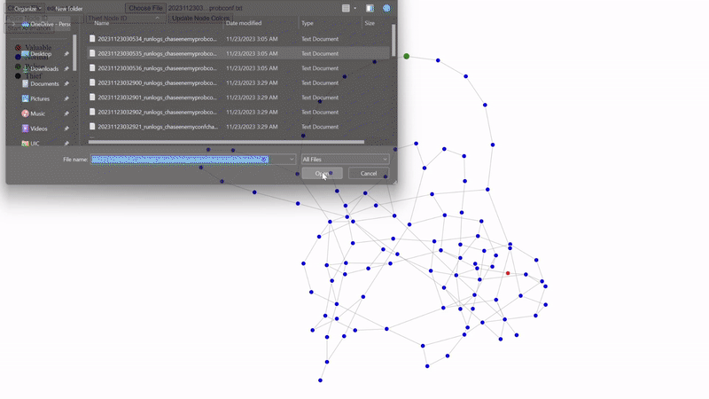

# Graph Visualizer for Policeman and Thief Graph Game

## Overview

This Graph Visualizer is a web-based tool designed for visualizing gameplay logs from the Policeman and Thief Graph Game. It uses D3.js, a powerful JavaScript library, to render interactive graphs representing the game state at different points in time. This visualization tool enhances the understanding of game dynamics and strategies by providing a clear graphical representation of the game's progress.

## Features

- **Dynamic Graph Rendering**: Displays the game's graph with nodes and links, highlighting valuable nodes, police, and thief positions.
- **Interactive Gameplay Animation**: Step through the game's progression and watch the movement of police and thief on the graph.
- **Custom Node Identification**: Update node colors dynamically based on the roles of police and thief.
- **File Input for Log Data**: Load game log data directly from a file for visualization.

## Getting Started

To use the Graph Visualizer, you need a web browser and the log files generated by the Policeman and Thief Graph Game client.

### Prerequisites

- A modern web browser (e.g., Google Chrome, Mozilla Firefox).
- Log files in the specified format generated by the game client.

### Running the Visualizer

1. **Open the HTML File**:
    - Download the `GraphVisualizer.html` file.
    - Open it in your web browser.
    - alternatively, you can visit the [website](https://chorpoliceviz.vercel.app/) to use the tool online.

2. **Load Graph Data**:
    - Click on the 'Choose File' button under 'Load Graph Data'.
    - Select the file containing the graph data (edges and nodes information).
    - examples of these files can be found in [example edges](./exampleEdgesFiles)

3. **Load Animation Data** (Optional):
    - Click on the 'Choose File' button under 'Load Animation Data'.
    - Select the file containing the animation data (sequential positions of police and thief).
    - examples of these files can be found in [example animation](./exampleVisLogs)

4. **Visualize**:
    - The graph will be rendered automatically upon loading the data.
    - Use the 'Update Node Colors' button to dynamically change the node colors based on input.
    - Click 'Start Animation' to begin the gameplay animation.

## User Interface

- **Graph Container**: Displays the graph. Nodes represent positions, and edges represent possible movements.
- **File Inputs**: For loading graph and animation data.
- **Node Color Update**: Text inputs for specifying police and thief node IDs and a button to update the visualization.
- **Start Animation**: Begins the step-by-step animation of the game.
